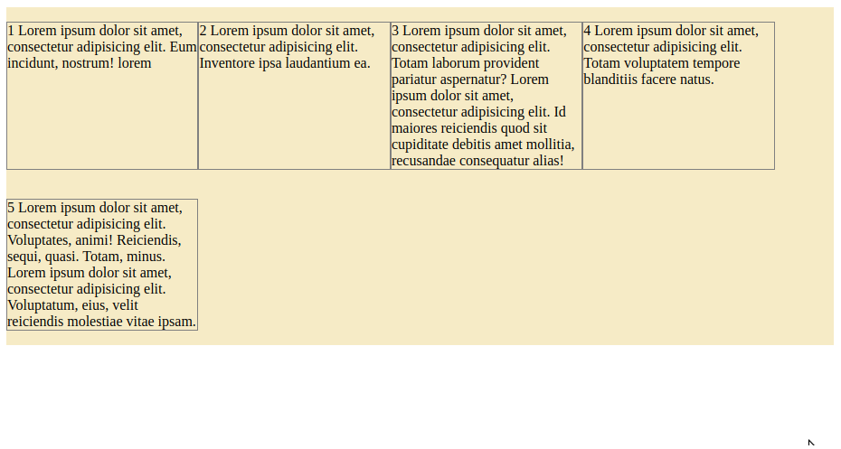

# Tarea con FLEX

## Disponer flex de manera nativa en el esqueleto del html.

>Código
```html
<!DOCTYPE html>

<html>

<head>

<meta charset="UTF-8" />

<meta name="author" content="juan carlos p.r."/>

<meta name="viewport" content="width=device-width, initial-scale=1.0"/>


<title>inicios con flex</title>


</head>
<style type="text/css" >

    header, section, footer, aside, nav, main, article, figure{
    
    display: block;
    
    }
    
    
    .contenedorFlex{
    
    display: flex;
    
    background: #F6EBC6;
    
    }
    
    p{

    max-width: 23%;

    }
    
    
    </style>

<body>

<main class="contenedorFlex">

<p>1 Lorem ipsum dolor sit amet, consectetur adipisicing elit. Eum incidunt, nostrum! lorem</p>

<p>2 Lorem ipsum dolor sit amet, consectetur adipisicing elit. Inventore ipsa laudantium ea.</p>

<p>3 Lorem ipsum dolor sit amet, consectetur adipisicing elit. Totam laborum provident pariatur aspernatur? Lorem ipsum dolor sit amet, consectetur adipisicing elit. Id maiores reiciendis quod sit cupiditate debitis amet mollitia, recusandae consequatur alias!</p>

<p>4 Lorem ipsum dolor sit amet, consectetur adipisicing elit. Totam voluptatem tempore blanditiis facere natus.</p>

<p>5 Lorem ipsum dolor sit amet, consectetur adipisicing elit. Voluptates, animi! Reiciendis, sequi, quasi. Totam, minus. Lorem ipsum dolor sit amet, consectetur adipisicing elit. Voluptatum, eius, velit reiciendis molestiae vitae ipsam.</p>

</main>

</body>

</html>


```

## Usando Flex con CSS.

```css
header, section, footer, aside, nav, main, article, figure{

    display: block;
    
    }
    
    
    .contenedorFlex{
    
    display: flex;
    
    
    background: #F6EBC6;
    
    }
    
    
    p{
    
    max-width: 20%;
    
    border: 1px solid gray;
    
    }
    
    
    
```

## Usando el FlexFLow en el CSS. Dando el siguiente resultado.

```css

 header, section, footer, aside, nav, main, article, figure{

display: block;

}


.contenedorFlex{

display: flex;

flex-flow: row wrap;

background: #F6EBC6;

}


p{

max-width: 23%;

border: 1px solid gray;

}

```

## Usando la propiedad FlexFlow con la opción reverse.

```css
 header, section, footer, aside, nav, main, article, figure{

display: block;

}


.contenedorFlex{

display: flex;

flex-flow: row-reverse wrap;

background: #F6EBC6;

}


p{

max-width: 23%;

border: 1px solid gray;

}

```

## Usando la propiedad FlexFLow con la opción de columna sin altura.

```css
 header, section, footer, aside, nav, main, article, figure{

display: block;

}


.contenedorFlex{

display: flex;

flex-flow: column wrap;

background: #F6EBC6;

}


p{

max-width: 23%;

border: 1px solid gray;

}

```
## Usando la propiedad FlexFlox con la opción de columna con altura.

```css
 header, section, footer, aside, nav, main, article, figure{

display: block;

}


.contenedorFlex{

display: flex;

flex-flow: column wrap;

background: #F6EBC6;

height: 400px;

}


p{

max-width: 23%;

border: 1px solid gray;

}
```
## Usando la propiedad FlexFlow con la opción de columna pero con reverse.

```css
 header, section, footer, aside, nav, main, article, figure{

display: block;

}


.contenedorFlex{

display: flex;

flex-flow: column-reverse wrap;

background: #F6EBC6;

height: 400px;

}


p{

max-width: 23%;

border: 1px solid gray;

}


```
# Usando el Justify Content

## Empezando a usar el Justify en el CSS.

```css
 header, section, footer, aside, nav, main, article, figure{

display: block;

}

.contenedorFlex{

display: flex;

flex-flow: row nowrap;

justify-content: flex-start;

background: #F6EBC6;

}


p{

max-width: 15%;

border: 1px solid gray;

}

```

## Usando el Justify content con Flex-end

```css
header, section, footer, aside, nav, main, article, figure{

    display: block;
    
    }
    
    .contenedorFlex{
    
    display: flex;
    
    flex-flow: row nowrap;
    
    justify-content: flex-end;
    
    background: #F6EBC6;
    
    }
    
    
    p{
    
    max-width: 15%;
    
    border: 1px solid gray;
    
    }
    
```

## Usando justify center


```css
header, section, footer, aside, nav, main, article, figure{

    display: block;
    
    }
    
    .contenedorFlex{
    
    display: flex;
    
    flex-flow: row nowrap;
    
    justify-content: center;
    
    background: #F6EBC6;
    
    }
    
    
    p{
    
    max-width: 15%;
    
    border: 1px solid gray;
    
    }

```

## Usando