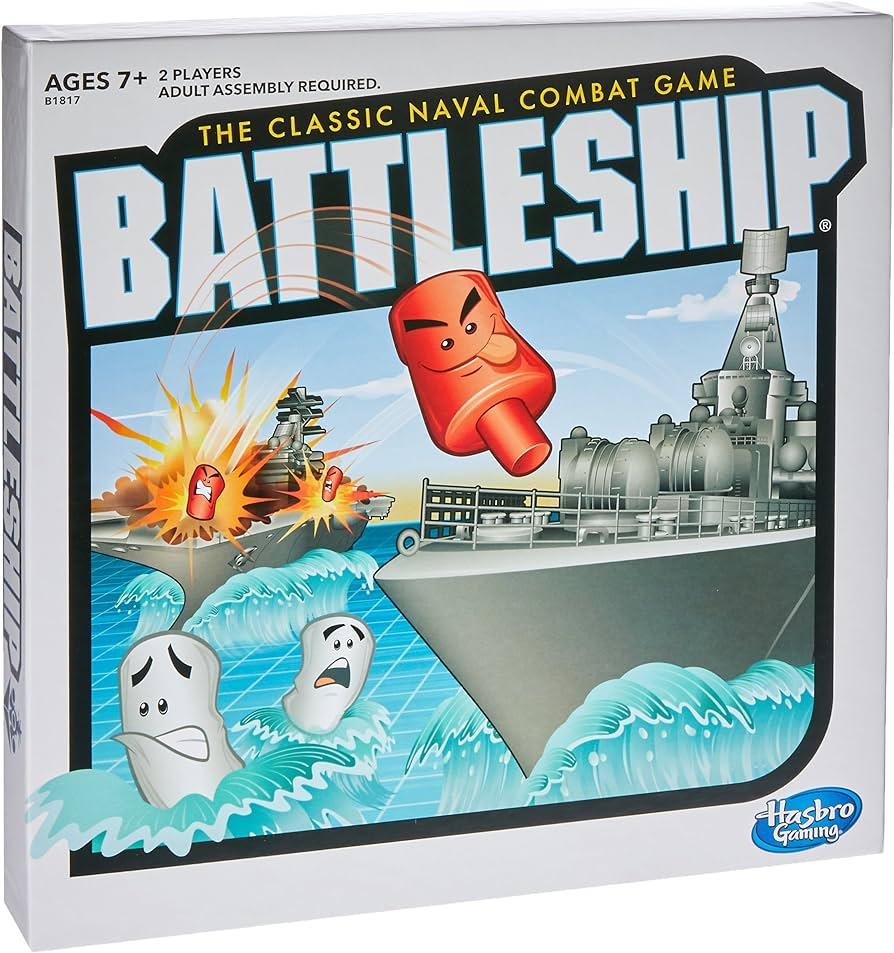

# José Domingo Rodríguez Rodríguez


# Proyecto Web
https://jdrguez.infinityfreeapp.com/?i=1


```html

<!DOCTYPE html>
<html lang="en">

<head>
    <meta charset="UTF-8">
    <meta name="viewport" content="width=device-width, initial-scale=1.0">
    <title>Proyecto LND</title>
    <link rel="stylesheet" href="main.css">
    <link rel="stylesheet" href="https://cdnjs.cloudflare.com/ajax/libs/font-awesome/6.5.2/css/all.min.css">
</head>

<body>
    <header class="header">
        <a href="#home" class="logo">José
            <span>Rodriguez</span></a>

        <i class="fa-solid fa-bars" id="menu-icon"></i>

        <nav class="navbar">
            <a href="#home" class="active">Inicio</a>
            <a href="#projects">Proyectos</a>
            <a href="#services">Formación</a>
            <a href="#contact">Contacto</a>
        </nav>
    </header>

    <section class="home" id="home">
        <div class="home-content">
            <h1>Hola, soy <span>José</span></h1>
            <h3 class="text-animation">Soy <span></span></h3>
            <p>
                Lorem ipsum dolor sit amet, consectetur adipisicing elit. Perferendis id cumque dicta iste dignissimos
                error a, eius maxime modi earum atque qui, est labore vel inventore voluptatum nostrum eos quod.
            </p>
            <div class="social-icons">
                <a href="#"><i class="fa-brands fa-linkedin"></i></a>
                <a href="#"><i class="fa-brands fa-square-instagram"></i></a>
                <a href="#"><i class="fa-brands fa-x-twitter"></i></a>
                <a href="https://github.com/jdrguez"><i class="fa-brands fa-github"></i></a>
            </div>

        </div>
        <div class="home-img">
            
        </div>
    </section>

    <section class="services" id="services">
        <h2 class="heading">Formación</h2>

        <div class="service-container">

            <div class="services-box">
                <i class="fa-solid fa-scale-balanced"></i>
                <h3>Derecho</h3>
                <p>Lorem ipsum dolor sit amet consectetur adipisicing elit. Maiores consectetur, labore consequuntur
                    magnam placeat, aliquid laborum doloremque nihil id officiis deserunt suscipit odio ex, corrupti
                    modi cumque at ipsam! Tenetur?
                </p>
                <a href="https://www.ull.es/" class="btn">ULL</a>
            </div>

            <div class="services-box">
                <i class="fa-solid fa-school"></i>
                <h3>DAM</h3>
                <p>Lorem ipsum dolor sit amet consectetur adipisicing elit. Maiores consectetur, labore consequuntur
                    magnam placeat, aliquid laborum doloremque nihil id officiis deserunt suscipit odio ex, corrupti
                    modi cumque at ipsam! Tenetur?
                </p>
                <a href="https://www3.gobiernodecanarias.org/medusa/edublog/iespuertodelacruztelesforobravo/" class="btn">IES PUERTO DE LA CRUZ</a>
            </div>

            <div class="services-box">
                <i class="fa-solid fa-school"></i>
                <h3>Bachillerato</h3>
                <p>Lorem ipsum dolor sit amet consectetur adipisicing elit. Maiores consectetur, labore consequuntur
                    magnam placeat, aliquid laborum doloremque nihil id officiis deserunt suscipit odio ex, corrupti
                    modi cumque at ipsam! Tenetur?
                </p>
                <a href="https://www3.gobiernodecanarias.org/medusa/edublog/iesmenceybencomo/" class="btn">IES MENCEY BENCOMO</a>
            </div>

        </div>
        
    </section>

    <section class="projects" id="projects">
        <h2 class="heading">Proyectos</h2>
        <div class="projects-container">
            <div class="projects-box">
                
                <div class="projects-info">
                    <h4>Hundir la flota en Python</h4>
                    <p>Lorem, ipsum dolor sit amet consectetur adipisicing elit. Voluptate cum distinctio soluta
                        quia debitis consequatur cupiditate vel! Fugit, enim deleniti! Cum, minus voluptas? Eos,
                        consectetur quia iusto voluptatem perferendis fugit?</p>
                </div>
            </div>

            <div class="projects-box">
                
                <div class="projects-info">
                    <h4>Bot en Python</h4>
                    <p>Lorem, ipsum dolor sit amet consectetur adipisicing elit. Voluptate cum distinctio soluta
                        quia debitis consequatur cupiditate vel! Fugit, enim deleniti! Cum, minus voluptas? Eos,
                        consectetur quia iusto voluptatem perferendis fugit?</p>
                </div>
            </div>


            <div class="projects-box">
                
                <div class="projects-info">
                    <h4>Combate Pokemon en Python</h4>
                    <p>Lorem, ipsum dolor sit amet consectetur adipisicing elit. Voluptate cum distinctio soluta
                        quia debitis consequatur cupiditate vel! Fugit, enim deleniti! Cum, minus voluptas? Eos,
                        consectetur quia iusto voluptatem perferendis fugit?</p>
                </div>
            </div>
        </div>

    </section>

    <section class="contact" id="contact">
        <h2 class="heading">Contácta<span>me</span></h2>

        <form action="#">
            <div class="input-box">
                <input type="text"
                placeholder="Nombre Completo">
                <input type="email"
                placeholder="Email">
            </div>
            <div class="input-box">
                <input type="number"
                placeholder="Número de telefono">
                <input type="text"
                placeholder="Sugerencias">
            </div>

            <textarea name="" id="" cols="30" rows="10" placeholder="Tu mensaje"></textarea>
            <input type="submit" value="Manda el mensaje" class="btn">
        </form>
    </section>       

    <footer class="footer">
        <div class="social">
            <a href="#"><i class="fa-brands fa-linkedin"></i></a>
            <a href="#"><i class="fa-brands fa-square-instagram"></i></a>
            <a href="#"><i class="fa-brands fa-x-twitter"></i></a>
            <a href="https://github.com/jdrguez"><i class="fa-brands fa-github"></i></a>
        </div>

        <ul class="list">
            <li>
                <a href="#">FAQ</a>
            </li>
            <li>
                <a href="#">Formación</a>
            </li>
            <li>
                <a href="#">Sobre Mí</a>
            </li>
            <li>
                <a href="#">Contacto</a>
            </li>
            <li>
                <a href="#">Política de privacidad</a>
            </li>
        </ul>
        <p class="copyright">
            © José Domingo Rodriguez | Todos los derechos Reservados
        </p>
    </footer>
    
    <script src="script.js"></script>

</body>

</html>
```


## Explicación del HTML
Este HTML crea una página web con una estructura clara y organizada. Incluye secciones para el encabezado, contenido principal (como inicio, proyectos, servicios y contacto), y el pie de página.
Encabezado (<header>): Contiene el logotipo, un icono de menú y una barra de navegación con enlaces a diferentes secciones de la página.
Sección "Inicio" (<section class="home">): Presenta un saludo, una breve descripción y enlaces a redes sociales.
Sección "Servicios" (<section class="services">): Muestra información sobre la formación con diferentes bloques de servicios.
Sección "Proyectos" (<section class="projects">): Exhibe diferentes proyectos con imágenes y descripciones.
Sección "Contacto" (<section class="contact">): Contiene un formulario de contacto para enviar mensajes.
Pie de página (<footer>): Incluye enlaces a redes sociales y otras páginas, además de un aviso de derechos de autor.
## Explicación del CSS:
### Fragmento 1: Estilos generales y del cuerpo:
```css
* {
 margin: 0;
 padding: 0;
 box-sizing: border-box;
 text-decoration: none;
 border: none;
 outline: none;
 scroll-behavior: smooth;
 font-family: "Poppins", sans-serif;
}

html {
 font-size: 62.5%;
 overflow-x: hidden;
}

body {
 background-color: rgba(15, 15, 15, 15);
 color: white;
}
```

Este fragmento establece estilos básicos y universales para todos los elementos, como el margen, el relleno, el comportamiento de desplazamiento y la familia de fuentes. También define el tamaño de fuente base y el color de fondo del cuerpo del documento.

## Fragmento 2: Encabezado y navegación
```css
.header {
 position: fixed;
 top: 0;
 left: 0;
 width: 100%;
 padding: 3rem 9%;
 background: rgba(0, 0, 0, 0.7);
 backdrop-filter: blur(10px);
 display: flex;
 justify-content: space-between;
 align-items: center;
 z-index: 100;
}

.logo {
 font-size: 3rem;
 color: white;
 font-weight: 800;
 cursor: pointer;
 transition: 0.3s ease-in-out;
}

.logo:hover {
 transform: scale(1.1);
}

.navbar a {
 font-size: 1.8rem;
 color: white;
 margin-left: 4rem;
 font-weight: 500;
 transition: 0.3s ease-in-out;
 border-bottom: 3px solid transparent;
}

.navbar a:hover,
.navbar a.active {
 color: rgb(230, 91, 91);
 border-bottom: 3px solid rgb(230, 91, 91);
}

#menu-icon {
 font-size: 3rem;
 color: rgb(230, 91, 91);
 display: none;
}
```
Este fragmento se encarga del estilo del encabezado y la navegación. Establece la posición fija del encabezado, estilos para el logotipo y los enlaces de navegación, además de los efectos de transición y transformación cuando el usuario interactúa con ellos.
Fragmento 3: Sección "Inicio" y animaciones de texto
```css
section {
 min-height: 100vh;
 padding: 10rem 9% 10rem;
}

.home {
 display: flex;
 justify-content: center;
 align-items: center;
 gap: 8rem;
}

.logo span {
 color: rgb(230, 91, 91);
}

.home-content h1 {
 font-size: 8rem;
 font-weight: 700;
 line-height: 1.3;
}

.home-img {
 border-radius: 50%;
}

.home-img img {
 position: relative;
 border-radius: 50%;
 width: 32vw;
 box-shadow: 0 0 15px rgb(230, 91, 91);
 cursor: pointer;
 transition: 0.4s ease-in-out;
}

.home-img img:hover {
 box-shadow: 0 0 50px rgb(230, 91, 91),
 0 0 100px rgb(230, 91, 91);
}

.home-content p {
 font-size: 1.8rem;
 font-weight: 500;
}

.social-icons a {
 display: inline-flex;
 justify-content: center;
 align-items: center;
 width: 4rem;
 height: 4rem;
 background: transparent;
 border: 0.2rem solid rgb(230, 91, 91);
 font-size: 2rem;
 border-radius: 50%;
 color: rgb(230, 91, 91);
 margin: 3rem 1.5rem 3rem 0;
 transition: 0.3s ease-in-out;
}

.social-icons a:hover {
 color: white;
 transform: scale(1.3) translateY(-5px);
 background-color: rgb(230, 91, 91);
 box-shadow: 0 0 25px rgb(230, 91, 91);
}

.text-animation {
 font-size: 42px;
 font-weight: 600;
 min-width: 280px;
 margin: 10px 0;
}

.text-animation span {
 position: relative;
}

.text-animation span::before {
 color: rgb(230, 91, 91);
 content: "Web Developer";
 animation: words 20s infinite;
}

.text-animation span::after {
 content: "";
 background-color: rgba(15, 15, 15, 15);
 position: absolute;
 width: calc(100% - 8px);
 height: 100%;
 border-left: 3px solid rgba(15, 15, 15, 15);
 right: -8px;
 animation: cursor 0.6s infinite, typing 20s steps(14) infinite;
}

@keyframes cursor {
 to {
 border-left: 2px solid rgb(230, 91, 91);
 }
}

@keyframes words {
 0%,
 20% {
 content: "Web Developer";
 }
 21%,
 40% {
 content: "Web Designer";
 }
 41%,
 60% {
 content: "Programmer";
 }
 61%,
 80% {
 content: "Backend-Designer";
 }
 81%,
 100% {
 content: "Gamer";
 }
}

@keyframes typing {
 10%,
 15%,
 30%,
 35%,
 50%,
 55%,
 70%,
 75%,
 90%,
 95% {
 width: 0;
 }
 5%,
 20%,
 25%,
 40%,
 45%,
 60%,
 65%,
 80%,
 85% {
 width: calc(100% + 8px);
 }
}
```
Este fragmento maneja el estilo de la sección "Inicio", incluyendo el diseño del contenido, la imagen de perfil, y los enlaces a redes sociales. También define las animaciones para el texto que cambia dinámicamente (text-animation) con efectos de cursor y palabras cambiantes.
Fragmento 4: Secciones "Servicios", "Proyectos" y "Contacto"
```css
.services {
 background-color: rgba(0, 0, 0, 0.5);
}

.services h2 {
 margin-bottom: 8rem;
}

.service-container {
 display: flex;
 align-items: center;
 justify-content: center;
 gap: 3rem;
}

.service-container .services-box {
 flex: 1 1 40rem;
 display: flex;
 flex-direction: column;
 align-items: center;
 justify-content: center;
 text-align: center;
 background: rgba(0, 0, 0, 0.5);
 padding: 3rem 2rem 4rem;
 height: 550px;
 border-radius: 2rem;
 border: 3px solid rgb(230, 91, 91);
 cursor: pointer;
 transition: 0.3s ease-in-out;
}

.service-container .services-box:hover {
 transform: scale(1.02);
 background-color: white;
 color: black;
}

.services-box i {
 font-size: 7rem;
 color: rgb(230, 91, 91);
 margin-bottom: 1rem;
}

.services-box h3 {
 font-size: 2.6rem;
}

.services-box p {
 font-size: 1.6rem;
 margin: 1rem 0 3rem;
 font-weight: 500;
}

.services-box .btn {
 background-color: transparent;
}

.services-box .btn:hover {
 background-color: rgb(230, 91, 91);
}

.projects-container {
 display: grid;
 grid-template-columns: repeat(3, 1fr);
 gap: 3rem;
}

.projects-container .project-box {
 background: rgba(0, 0, 0, 0.5);
 border-radius: 2rem;
 cursor: pointer;
 border: 3px solid rgb(230, 91, 91);
 overflow: hidden;
}

.projects-container .project-box img {
 height: 100%;
 width: 100%;
 object-fit: cover;
 transition: 0.4s ease-in-out;
}

.projects-container .project-box:hover img {
 transform: scale(1.2);
}

.contact form {
 max-width: 75rem;
 margin: auto;
}

.contact .input-group {
 display: flex;
 flex-direction: column;
 width: 100%;
 padding: 1.2rem 0;
}

.contact .input-group input,
.contact .input-group textarea {
 width: 100%;
 padding: 1.5rem 2rem;
 font-size: 1.6rem;
 color: white;
 background: rgba(0, 0, 0, 0.5);
 border-radius: 0.5rem;
}

.contact .input-group input:focus,
.contact .input-group textarea:focus {
 border-left: 3px solid rgb(230, 91, 91);
}

.contact .btn {
 background-color: rgb(230, 91, 91);
 display: inline-block;
 padding: 1.5rem 3rem;
 color: white;
 margin-top: 2rem;
 cursor: pointer;
 font-size: 1.6rem;
 border-radius: 0.5rem;
 transition: 0.3s ease-in-out;
}

.contact .btn:hover {
 transform: scale(1.2);
 background: rgba(0, 0, 0, 0.5);
}

footer {
 text-align: center;
 padding: 4rem 0;
 background: rgba(0, 0, 0, 0.5);
}

footer span {
 color: white;
 font-size: 1.6rem;
 font-weight: 500;
}

footer a {
 color: rgb(230, 91, 91);
}
```
Este fragmento se ocupa del estilo de las secciones "Servicios", "Proyectos" y "Contacto", así como del pie de página. Incluye estilos para contenedores, cajas de servicio, cajas de proyecto y formularios de contacto, con efectos de transición y transformaciones al interactuar con ellos. También define los estilos del pie de página, asegurando una apariencia coherente y profesional.
